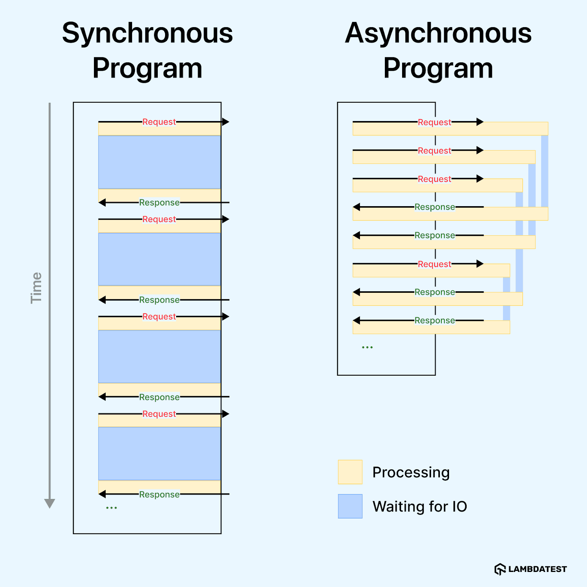
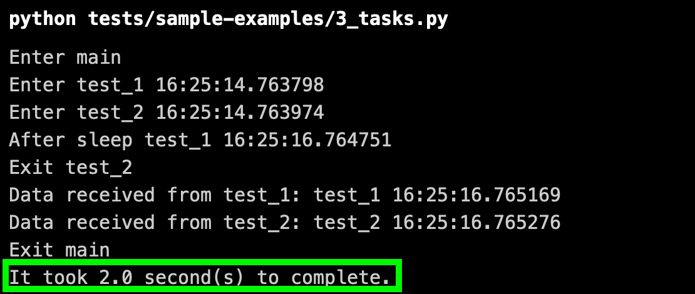

Wanneer je leert te programmeren, start je normaal "synchroon". Dat wil zeggen dat je, nadat je een actie bent begonnen, niets anders doet tot het resultaat er is.

Je hebt misschien ook al gehoord over "parallelisme", "multiprocessing" of "multithreading". Daarmee wordt doorgaans bedoeld dat je hardware meerdere CPU-cores ter beschikking heeft die tegelijkertijd aan het werk kunnen zijn.

Iets abstracter (maar eigenlijk eenvoudiger dan multithreading) is asynchroon programmeren. Dit valt net als "parallelisme" onder de algemene noemer "concurrency", maar het heeft niets te maken met meerdere CPU-cores. Het houdt eigenlijk in dat je vermijdt dat je code "blokkeert".

Onderstaande figuur toont het principe:

Klassieke Python functies zijn "blocking". Eens ze opgestart zijn, maken ze hun werk af. *Coroutines* zijn Python functies die je definieert met `async def` in plaats van `def`. Hun uitvoering kan gepauzeerd worden door het `await` keyword in hun body. Dat keyword kan gebruikt worden voor de oproep van een andere coroutine. Wanneer dit gebeurt, wordt nagegaan of er ander werk staat te wachten in de *event loop*. Dit is een soort wachtrij voor coroutines, waar taken uit gepikt kunnen worden op het moment dat ze iets kunnen doen (niet staan te wachten).

Coroutines leveren pas efficiëntiewinst als er meerdere taken tegelijkertijd in de event loop staan. Dat kan je bereiken door coroutines eerst om te zetten naar "Tasks", door middel van `asyncio.create_task`. Anders heb je code die wel kan wachten, maar geen andere code om intussen al aan de slag te gaan.

Bestudeer de codevoorbeelden op [deze pagina](https://www.lambdatest.com/blog/python-asyncio/), vanaf het titeltje "Coroutines" tot en met deze screenshot:

**Bekijk de timings in de screenshots heel aandachtig en zorg dat je het gedrag begrijpt dat deze timings verklaart!**
