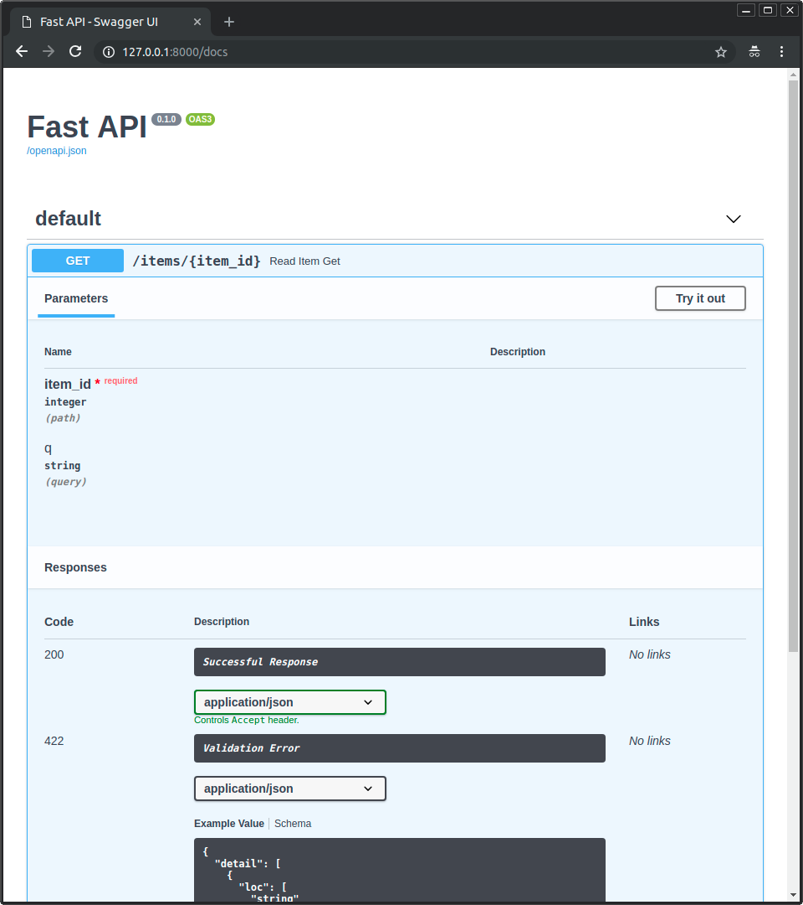

Eén van de manieren waarop FastAPI het ontwikkelen van API's makkelijk maakt, is via de automatische generatie van documentatie. 
Als je je webapplicatie opstart op `127.0.0.1`, kan je (by default) naar `127.0.0.1:8000/docs` surfen en krijg je een UI aangeboden waarop je meteen je HTTP-methoden kan uitvoeren. Dit is vaak makkelijker dan het gebruik van extra tools zoals cURL, Thunder Client, Postman,...

