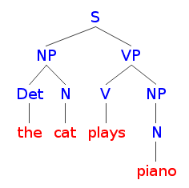
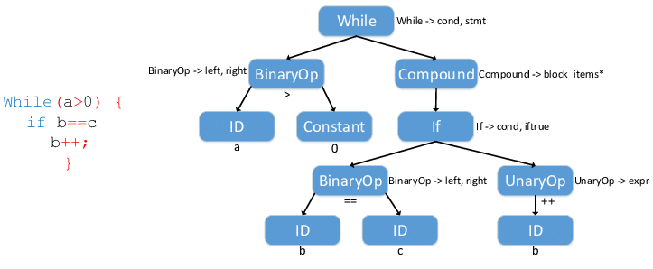

De meeste programmeertalen hebben een complexe grammatica met nesting van concepten.
Om een programma correct uit te voeren, kan je niet alleen kijken naar substrings, maar moet je de plaats van een stuk tekst in het grotere geheel bekijken.

Vergelijk dit met de analyse van zinnen in natuurlijke taal.
Die leer je tijdens je schoolcarrière ontleden tot een boomstructuur als volgt:

In het Engels geldt:

- een zin ("sentence", vandaar "S") bestaat uit een onderwerp ("noun phrase" of "NP") en een persoonsvorm ("verb phrase", vandaar "VP")
- een noun phrase bestaat minstens uit een lidwoord ("determiner", hier "the") en een zelfstandig naamwoord ("noun")
- een verb phrase bestaat minstens uit een werkwoord ("verb") en kan gevolgd worden door een noun phrase als er een lijdend voorwerp is

Dit vertelt ons dat het de kat is die piano speelt, niet dat de piano op de kat speelt ("The piano plays cat"), of dat iemand genaamd "Cat" op de piano speelt ("Cat plays the piano").

Je kan dus niet gewoon woorden verzamelen om de betekenis af te leiden, de structuur is belangrijk. Deze structuur noemen we de "syntaxis" van de taal. De boomstructuur van eerder noemen we ook een "syntaxisboom" of "syntax tree".

Voor programmeertalen is syntaxis minstens even belangrijk als voor natuurlijke talen. De syntaxis bepaalt bijvoorbeeld dat elk geopend haakje terug gesloten moet worden, welke constructies in andere constructies gebruikt mogen worden (bijvoorbeeld een `if` in een `while` of omgekeerd) en in welke volgorde alles dan verwerkt wordt. Als je editor aangeeft dat ergens een puntkomma ontbreekt of dat je een bepaalde constructie niet mag gebruiken op een bepaalde plaats, komt dat er op neer dat er geen geldige syntaxisboom kan worden opgesteld volgens de grammaticale regels van je programmeertaal.

Hier zie je bijvoorbeeld de analyse van een `while`-lus in een typische programmeertaal (niet Python, maar dat zal er erg gelijkaardig uitzien):

De eerste taak van (bijna) elke compiler is om dit soort boom op te stellen.
